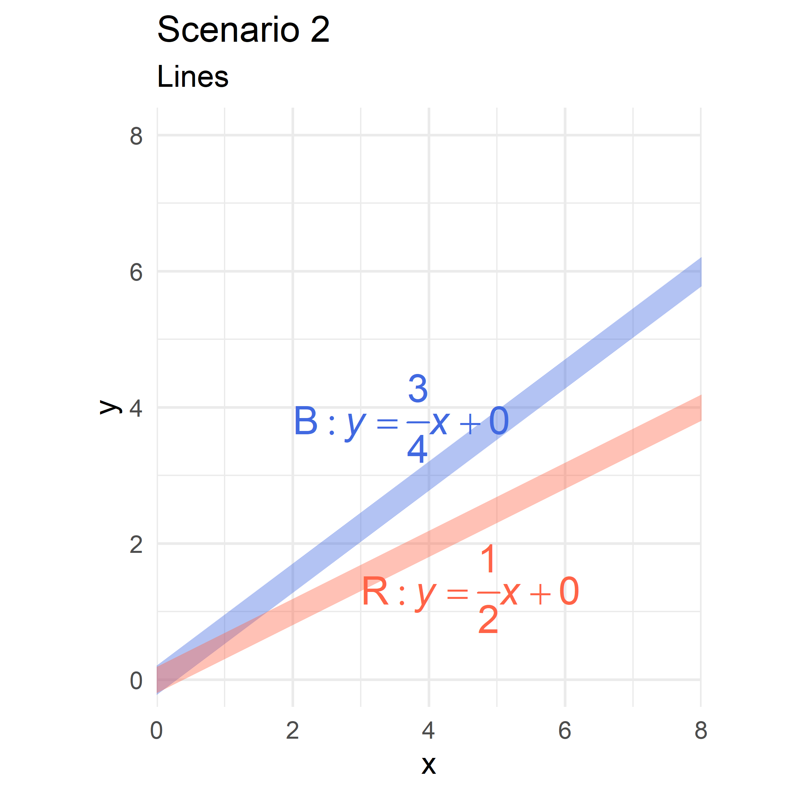
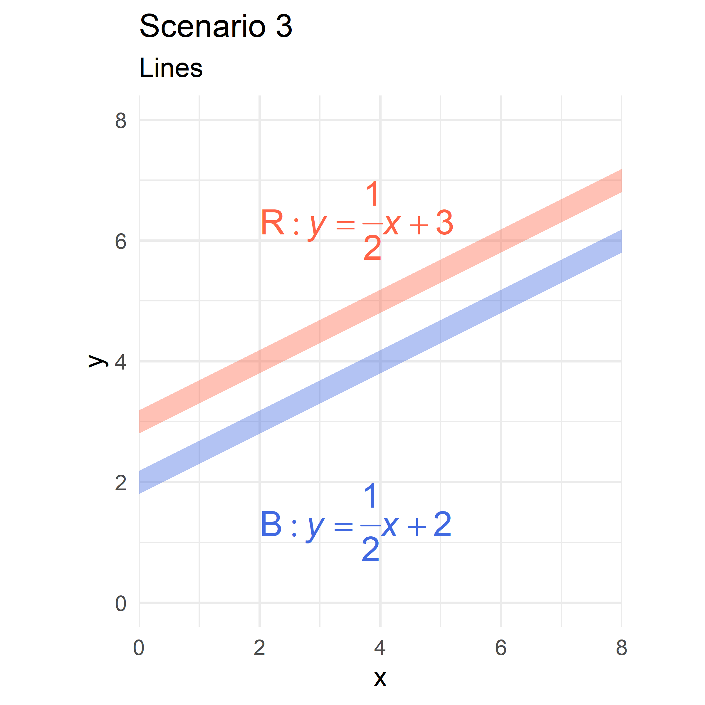
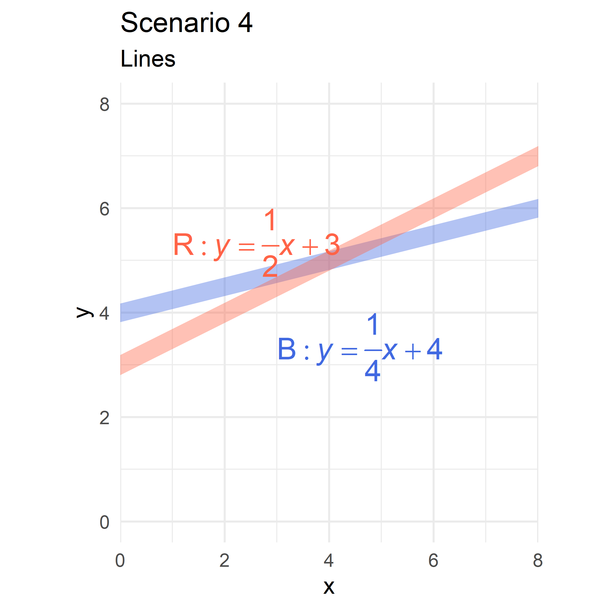
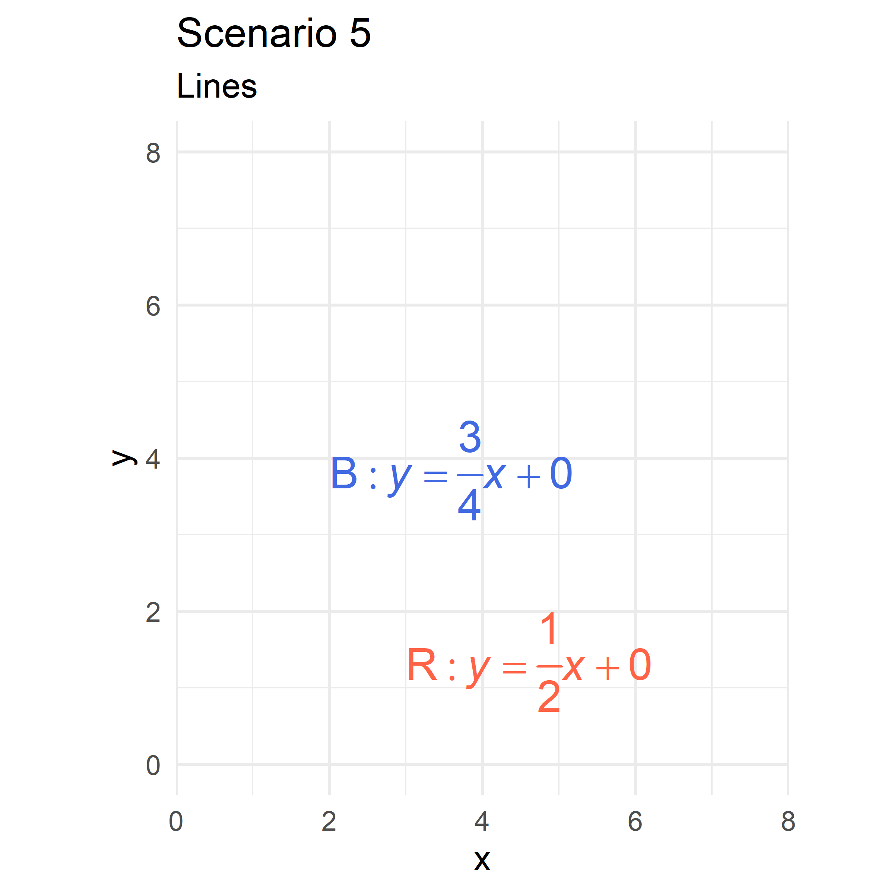
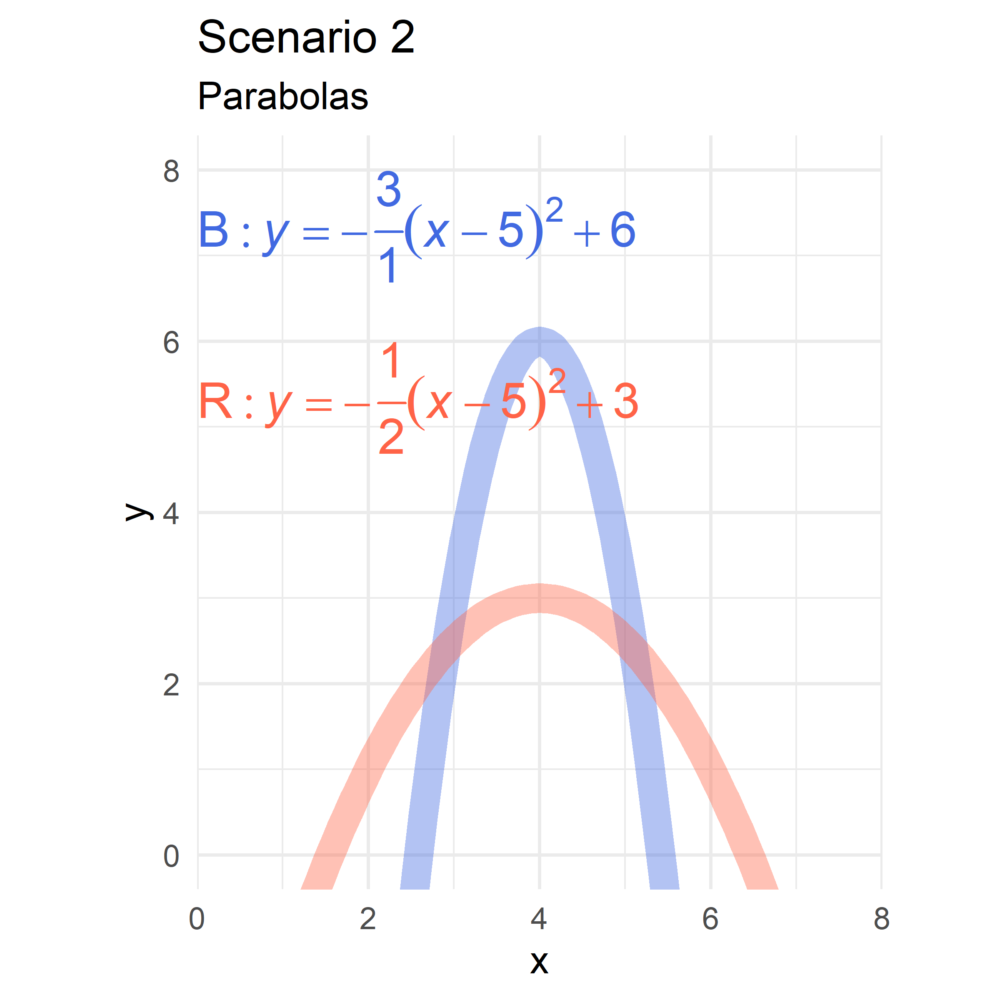
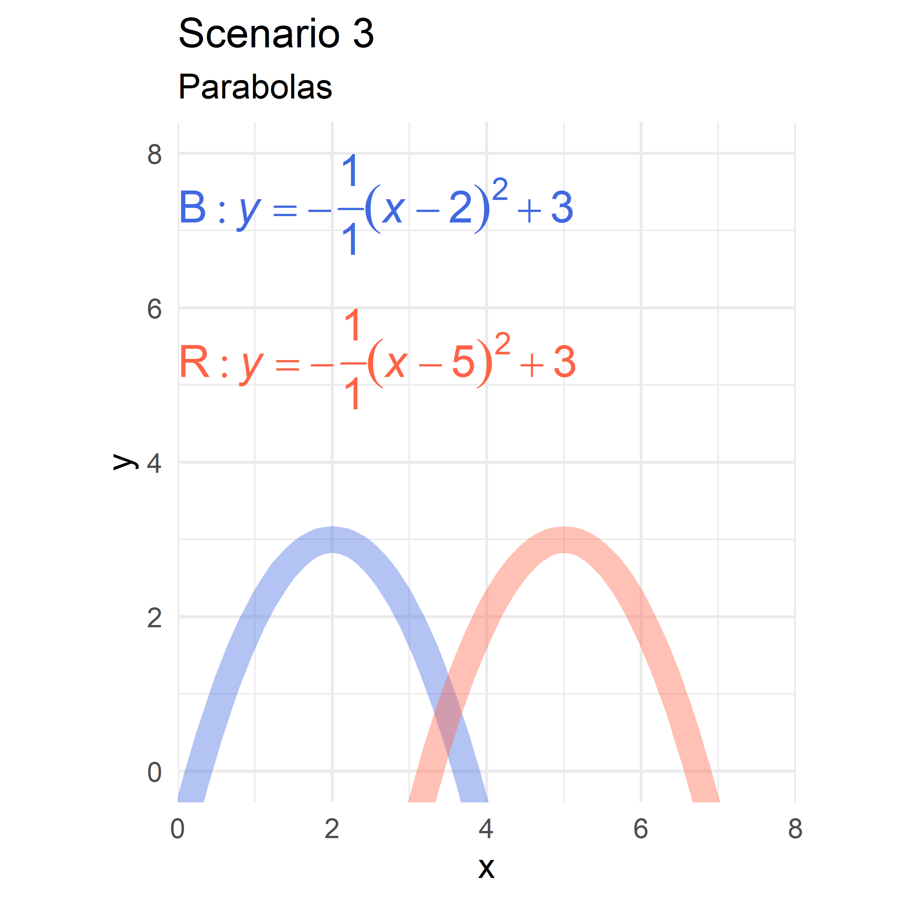
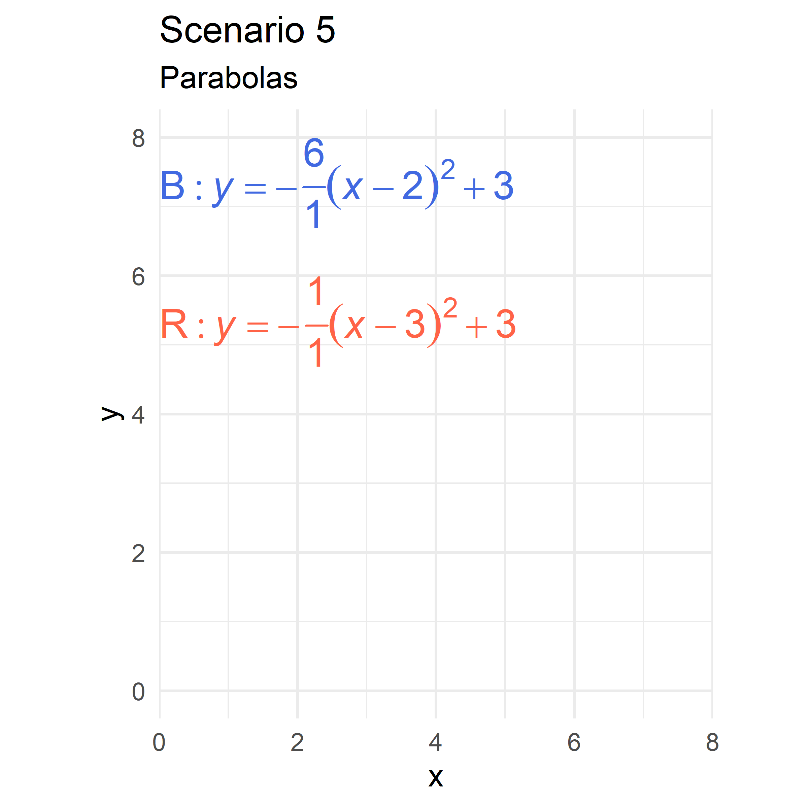

::: {.cell}

:::

## Lines

The following red & blue hills are modeled by a line. "Hill B" is blue and "Hill R" is red In each scenario, is it more difficult to bike on Hill B or Hill R?

::: {.cell layout-ncol="2"}
::: {.cell-output-display}

:::

::: {.cell-output-display}

:::

::: {.cell-output-display}

:::

::: {.cell-output-display}

:::

::: {.cell-output-display}

:::

::: {.cell-output-display}

:::
:::

## Parabolas

The following red & blue hills are modeled by a parabola "Hill B" is blue and "Hill R" is red In each scenario, is it more difficult to bike on Hill B or Hill R?

::: {.cell layout-ncol="2"}
::: {.cell-output-display}

:::

::: {.cell-output-display}

:::

::: {.cell-output-display}

:::

::: {.cell-output-display}

:::

::: {.cell-output-display}

:::
:::
